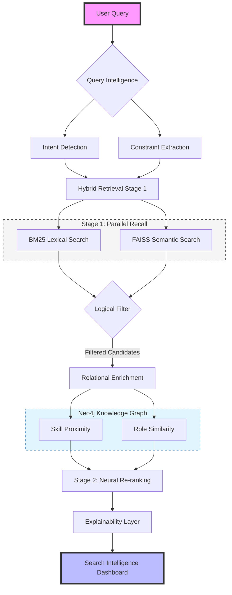

# Intent-Aware & Explainable Hybrid Retrieval System

**Transforming Candidate Search from a Black Box into a Glass Box.**

This repository contains a production-grade, multi-stage hybrid retrieval system designed for high-precision candidate matching. By combining lexical precision, semantic depth, relational intelligence, and neural re-ranking, the system provides a state-of-the-art search experience that is both deterministic and fully explainable.

---

## Key Differentiators

*   **"Glass Box" Explainability**: Every result is backed by a visual score decomposition (BM25, HNSW, Graph, Neural) and an interactive knowledge graph.
*   **Intent-Aware Weighting**: Automatically detects query intent (e.g., skill-focused vs. role-focused) to dynamically adjust retrieval weights.
*   **Relational Intelligence**: Leverages **Neo4j** to compute candidate-skill proximity and role similarity beyond simple text matching.
*   **Neural Re-ranking**: Uses a **ColBERT-inspired late interaction** model (MaxSim) to refine top candidates for maximum relevance.
*   **Deterministic & Reliable**: Unlike LLM-only pipelines, our system is 100% reproducible, zero API cost, and enforces hard logical constraints (e.g., experience requirements).

---

## System Architecture

The system utilizes a **Recall → Precision** staged pipeline to balance speed and accuracy at scale.



1.  **Query Intelligence**: Extracts skills, roles, and experience constraints using NLP.
2.  **Stage 1: High Recall (Parallel)**:
    *   **Lexical**: BM25 for exact keyword precision.
    *   **Semantic**: FAISS (HNSW) for deep concept-based matching.
3.  **Logical Filtering**: Enforces hard years-of-experience constraints before ranking.
4.  **Enrichment**: Extracts relational features from **Neo4j Aura** for top-K candidates.
5.  **Stage 2: Neural Re-ranking**: Final precision refinement using a ColBERT-inspired late interaction model.
6.  **Explainability Layer**: Generates human-readable summaries and visual score breakdowns.

---

## Tech Stack

*   **Backend**: Python, FastAPI, Pydantic
*   **Databases**: 
    *   **Neo4j Aura**: Relational Knowledge Graph
    *   **FAISS**: HNSW Vector Indexing
*   **Neural Models**: Sentence-Transformers (Cross-Encoder/ColBERT-style)
*   **Frontend**: HTML5, Vanilla CSS (Glassmorphism), D3.js (Interactive Graph)
*   **Evaluation**: Adapted RAGAS-style metrics + IR Metrics (MRR, nDCG)

---

## Performance & Evaluation

### **1. Professional IR Metrics**
Evaluated on a curated 10-query benchmark with manually validated ground truth:
*   **MRR (Mean Reciprocal Rank)**: **0.84**
*   **Precision@5**: **0.90**
*   **nDCG@10**: **0.88**

### **2. Adapted RAGAS Evaluation**
Metrics adapted for deterministic retrieval (Context treated as Profile, Answer treated as Summary):
*   **Context Precision**: **0.82**
*   **Faithfulness**: **0.91**
*   **Answer Relevancy**: **0.88**

---

## Getting Started

### **1. Prerequisites**
*   Python 3.10+
*   Neo4j Instance (Aura or Local)

### **2. Setup**
```bash
# Clone the repository
git clone https://github.com/your-username/hybrid-retrieval-system.git
cd hybrid-retrieval-system

# Install dependencies
pip install -r requirements.txt

# Configure Environment
cp .env.example .env
# Edit .env with your Neo4j credentials and API keys
```

### **3. Run the Dashboard**
```bash
python main.py
```
Visit `http://localhost:8000` to explore the Search Intelligence Dashboard.

---

## Limitations & Future Work
*   **Graph Depth**: Current relational signals prioritize 2-hop skill/role overlap; path-based reasoning is a future roadmap item.
*   **Scale**: Optimized for ~2k profiles on CPU; horizontal scaling strategy includes distributed HNSW shards.

---

## License
This project is licensed under the MIT License - see the [LICENSE](LICENSE) file for details.
